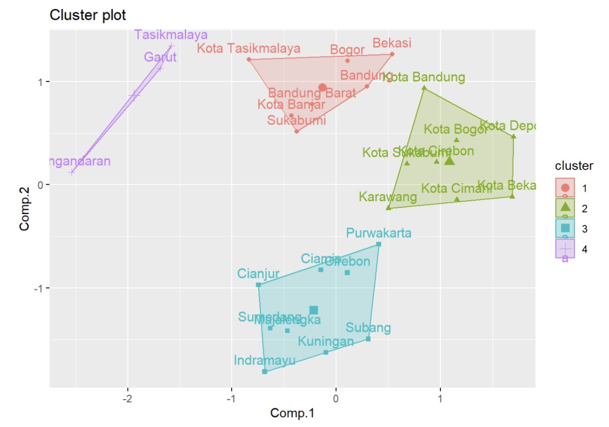
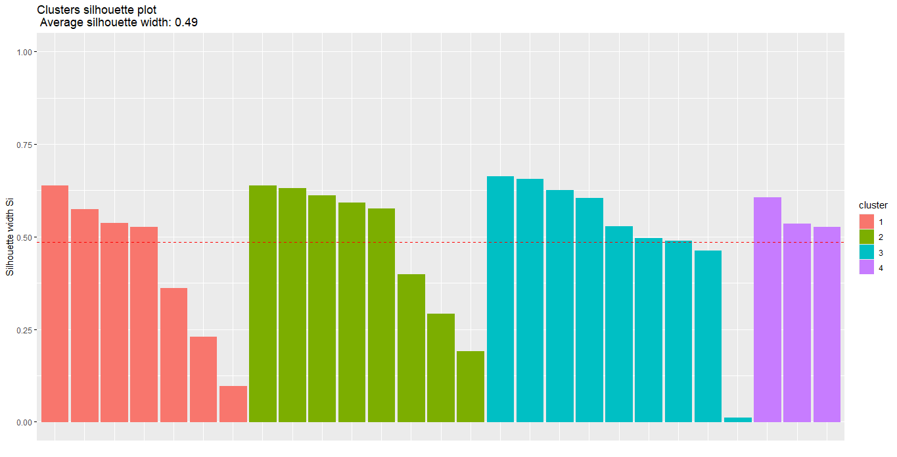
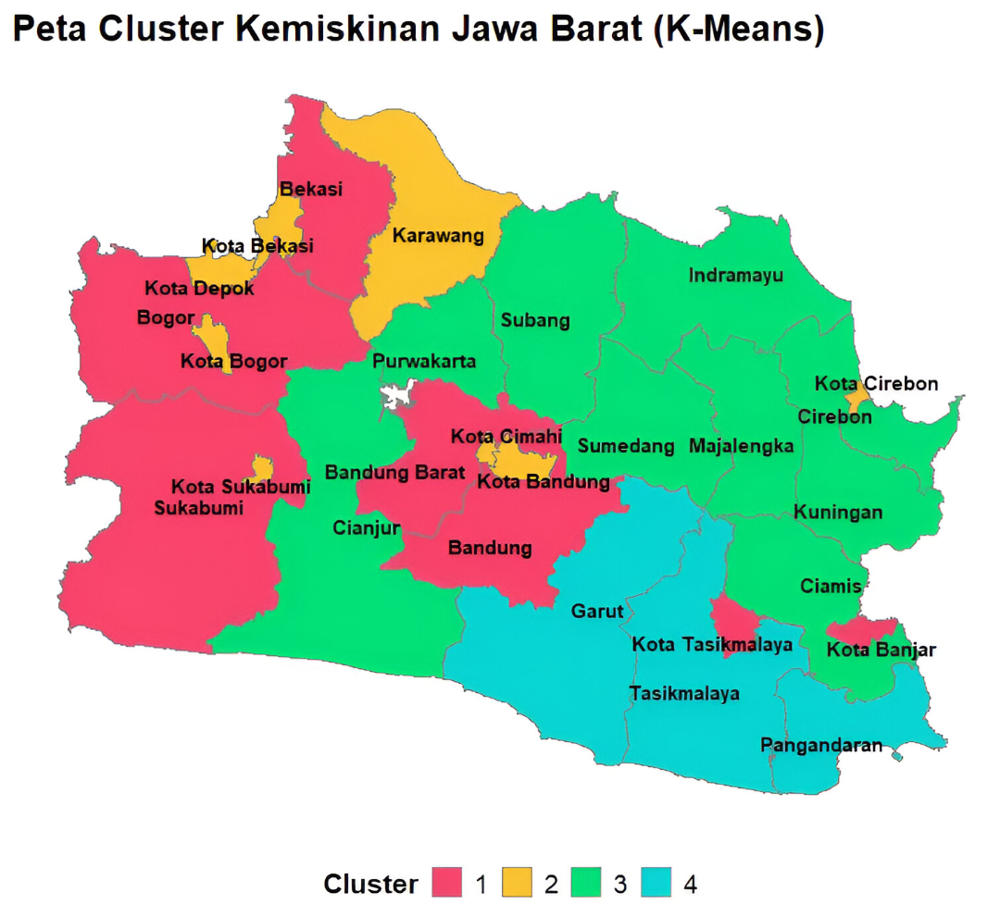
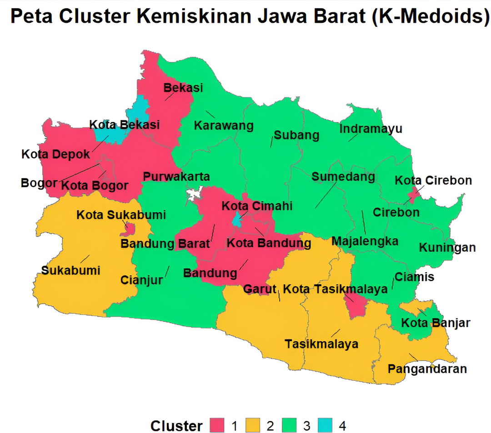

  
   

# 📖 **Pendahuluan**
Proyek ini menganalisis **pengelompokan wilayah di Jawa Barat** berdasarkan **indikator kemiskinan** dengan membandingkan metode ***K-Means*** dan ***K-Medoids***. Perbandingan ini dilakukan untuk melihat **perbedaan hasil klaster** dari kedua metode dan **menentukan pendekatan yang lebih sesuai** dalam menggambarkan **pola kemiripan kondisi kemiskinan antar wilayah**.

# 💡 **Latar Belakang**

Provinsi Jawa Barat merupakan salah satu provinsi dengan jumlah penduduk terpadat dan kontributor Produk Domestik Regional Bruto (PDRB) terbesar di Indonesia. Meskipun menunjukkan pertumbuhan ekonomi yang pesat, isu kemiskinan tetap menjadi masalah struktural yang memerlukan penanganan serius. Data menunjukkan bahwa disparitas kemiskinan antar wilayah (Kabupaten/Kota) di Jawa Barat cukup signifikan, dipengaruhi oleh berbagai faktor mulai dari akses pendidikan, lapangan kerja, infrastruktur, hingga kondisi geografis.

Penanganan kemiskinan yang efektif tidak bisa dilakukan dengan pendekatan one-size-fits-all (satu ukuran untuk semua). Kebijakan pengentasan kemiskinan harus diferensiasi dan spesifik berdasarkan karakteristik dan profil kemiskinan yang unik di setiap wilayah. Hal ini menuntut adanya proses identifikasi dan pengelompokan wilayah yang memiliki profil kemiskinan serupa.

Dalam konteks analisis data pembangunan, teknik pengelompokan data (clustering) menjadi instrumen krusial untuk mengelompokkan data multidimensi (berbagai indikator kemiskinan) menjadi kelompok-kelompok homogen (klaster). Melalui klasterisasi, pemerintah daerah dapat:
 * Mengenali pola-pola kemiskinan yang serupa di berbagai wilayah.
 * Memfokuskan sumber daya dan program bantuan pada klaster wilayah yang membutuhkan intervensi    spesifik.
 * Menetapkan prioritas kebijakan berdasarkan tipe-tipe kemiskinan yang teridentifikasi.

Untuk melakukan pengelompokan, dua metode algoritma yang sering digunakan dan menjadi fokus perbandingan adalah K-Means dan K-Medoids (Partitioning Around Medoids - PAM).
 1. K-Means: Metode yang populer karena efisiensi komputasi dan kesederhanaannya. Namun, K-       Means menggunakan nilai rata-rata (mean) sebagai pusat klaster (centroid), menjadikannya        rentan terhadap outliers (data pencilan) atau nilai-nilai ekstrem. Data karakteristik           kemiskinan, seperti persentase pengangguran atau rata-rata lama sekolah, seringkali             mengandung outliers yang dapat mendistorsi hasil klasterisasi.
 2. K-Medoids (PAM): Metode ini mengatasi kelemahan K-Means dengan menggunakan medoids (titik     data aktual) sebagai pusat klaster, bukan rata-rata. Pendekatan ini membuat K-Medoids lebih     robust terhadap outliers karena pusat klaster tidak ditarik oleh nilai ekstrem.

# 🎯 **Tujuan Penelitian**
1️⃣ **Mengelompokkan** wilayah di Jawa Barat berdasarkan karakteristik kemiskinan **menggunakan** metode klasterisasi ***K-Means*** dan ***K-Medoids***.  
2️⃣ **Menentukan metode** yang paling **optimal** dalam menghasilkan **klaster** yang representatif sebagai dasar rekomendasi kebijakan.  

# 📊 **Data dan Variabel**
<table style="border: 1px solid #d0d7de; border-radius: 10px; width: 100%; background-color: #fefefe; box-shadow: 0 1px 3px rgba(0,0,0,0.08);">
  <tr>
    <td style="width: 160px; text-align: center; padding: 15px;">
       
    </td>
    <td style="vertical-align: middle; padding: 12px 20px; font-size: 15px;">
      📌 <b>Sumber Data:</b> Badan Pusat Statistik (BPS) – Provinsi Jawa Barat 
      📅 <b>Tahun:</b> 2024 
      📍 <b>Unit Analisis:</b> 27 Kabupaten/Kota 
      🧩 <b>Variabel:</b> 9 indikator kemiskinan (X1–X9) 
    </td>
  </tr>
</table>

### Variabel
| Kode | Nama Variabel                                                                 |
|------|-------------------------------------------------------------------------------|
| X1   | Persentase Penduduk Miskin Usia 15+ Tidak Bekerja                             |
| X2   | Persentase Penduduk Miskin Usia 15+ Pekerja Informal                          |
| X3   | Persentase Penduduk Miskin Usia 15+ Pekerja Formal                            |
| X4   | Persentase Pengeluaran per Kapita Rumah Tangga Miskin untuk Makanan           |
| X5   | Persentase Pengeluaran per Kapita Rumah Tangga Miskin untuk Bukan Makanan     |
| X6   | Persentase Rumah Tangga Miskin yang menggunakan Air Layak                     |
| X7   | Persentase Rumah Tangga Miskin yang menggunakan Jamban Sendiri/Bersama        |
| X8   | Indeks Kedalaman Kemiskinan                                                   |
| X9   | Indeks Keparahan Kemiskinan                                                   |

###  Cuplikan Data
| Kabupaten/Kota   |   X1  |   X2  |   X3  |   X4  |   X5  |   X6  |   X7  |  X8  |  X9  |
|------------------|-------|-------|-------|-------|-------|-------|-------|------|------|
| Bogor            | 42.12 | 24.35 | 33.53 | 62.81 | 37.19 | 79.77 | 92.83 | 1.08 | 0.26 |
| Sukabumi         | 40.40 | 37.22 | 22.38 | 67.45 | 32.55 | 94.16 | 89.38 | 0.88 | 0.20 |
| Cianjur          | 37.36 | 42.34 | 20.30 | 66.02 | 33.98 | 92.71 | 93.89 | 1.58 | 0.41 |
| Bandung          | 38.87 | 26.07 | 35.06 | 64.58 | 35.42 | 91.80 | 94.30 | 0.61 | 0.09 |
| Garut            | 38.26 | 39.13 | 22.60 | 68.37 | 31.63 | 78.97 | 78.24 | 1.41 | 0.29 |
| ...              |  ...  |  ...  |  ...  |  ...  |  ...  |  ...  |  ...  | ...  | ...  |
| Kota Cirebon     | 44.40 | 22.30 | 33.30 | 60.74 | 39.26 | 89.26 | 100   | 1.18 | 0.25 |
| Kota Bekasi      | 41.56 | 17.83 | 40.61 | 54.15 | 45.85 | 100   | 98.09 | 0.80 | 0.21 |
| Kota Depok       | 40.43 | 18.31 | 41.26 | 56.42 | 43.58 | 100   | 100   | 0.34 | 0.07 |
| Kota Cimahi      | 39.74 | 21.43 | 38.83 | 60.10 | 39.90 | 100   | 100   | 0.83 | 0.21 |
| Kota Banjar      | 40.80 | 32.07 | 27.13 | 69.81 | 30.19 | 95.34 | 87.53 | 1.03 | 0.29 |

# ⚙️ **Metodologi Penelitian**
1. Jenis dan Pendekatan Penelitian 
   Penelitian ini merupakan penelitian kuantitatif eksploratir dengan pendekatan unsupervised learning menggunakan metode clustering. Tujuan utamanya adalah untuk mengelompokkan kabupaten/kota di Provinsi Jawa Barat berdasarkan karakteristik kemiskinan serta membandingkan hasil pengelompokan antara metode K-Means dan K-Medoids
3. Tahapan Analisis Data  
   a. Prapemrosesan Data (Preprocessing) 
   Pada tahapan ini dilakukan seleksi variabel untuk analisis dan pemeriksaan outlier.  
   b. Analisis Korelasi Antar Variabel 
   c. Analisis Reduksi Dimensi dengan PCA 
4. Klasterisasi Menggunakan Metode K-Means 
   K-Means adalah metode klasterisasi non-hierarkis yang mengelompokkan data ke dalam K klaster berdasarkan kedekatan jarak terhadap pusat klaster (centroid). Metode ini bertujuan meminimalkan jumlah kuadrat jarak dalam klaster (Within Cluster Sum of Squares/WCSS). 
   a. Menghitung jarak antar observasi  
   b. Menentukan banyaknya klaster optimal  
   c. Pembentukan klaster  
   d. Menghitung silhouette score  
   e. Profilisasi klaster  
5. Klasterisasi Menggunakan Metode K-Medoids 
   K-Medoids merupakan pengembangan dari K-means yang menggunakan medoid (objek aktual dalam dataset) sebagai pusat klaster. Metode ini dikenal sebagai algoritma PAM (Partitioning Around Medoids).
   a. Penentuan jumlah klaster menggunakan metode silhouette coefficient  
   b. Menentukan banyaknya klaster optimal  
   c. Pembentukan klaster  
   d. Menghitung silhouette score  
   e. Profilisasi klaster  
6. Evaluasi dan Perbandingan Klaster 
   Evaluasi dilakukan dengan membandingkan nilai Silhouette antar 2 metode. 
7. Visualisasi Klaster  

## A. Statistik Deskriptif
Statistik deskriptif digunakan untuk memberikan gambaran umum mengenai sebaran nilai indikator kemiskinan pada 27 kabupaten/kota di Provinsi Jawa Barat. Berdasarkan tabel di bawah, terlihat bahwa setiap variabel memiliki nilai rata-rata dan variasi yang berbeda, sehingga menunjukkan adanya perbedaan kondisi antar wilayah dan pentingnya dilakukan analisis lanjutan seperti clustering.

| Variabel|  N |  Mean | Std Dev |  Min  |   Q1   | Median |   Q3   |  Max  |
|---------|----|-------|---------|-------|--------|--------|--------|-------|
| **X1**  | 27 | 39.58 |   3.87  | 25.10 | 38.01  | 40.40  | 41.74  | 44.58 |
| **X2**  | 27 | 31.12 |   8.86  | 17.24 | 24.18  | 31.24  | 38.17  | 50.83 |
| **X3**  | 27 | 29.30 |   6.44  | 20.30 | 23.86  | 27.48  | 34.44  | 41.26 |
| **X4**  | 27 | 64.02 |   4.01  | 54.15 | 61.60  | 64.75  | 66.06  | 71.27 |
| **X5**  | 27 | 35.98 |   4.01  | 28.73 | 33.94  | 35.25  | 38.40  | 45.85 |
| **X6**  | 27 | 92.15 |   7.98  | 74.47 | 88.80  | 94.16  | 98.70  | 100.0 |
| **X7**  | 27 | 93.82 |   5.75  | 78.24 | 91.20  | 95.19  | 97.86  | 100.0 |
| **X8**  | 27 |  1.18 |   0.43  |  0.34 |  0.88  |  1.17  |  1.50  |  2.05 |
| **X9**  | 27 |  0.28 |   0.13  |  0.07 |  0.20  |  0.26  |  0.36  |  0.54 |

#### Matriks Korelasi

  

Berdasarkan matriks korelasi tersebut dilakukan seleksi variabel pada data. Seleki dilakukan dengan memerhatikan korelasi antar variabel, sehingga yang dibuang adalah variabel X3, X5 dan X9. Variabel yang telah diseleksi yaitu X1, X2, X4, X6, X7, X8 akan digunakan dalam melakukan analisis komponen utama. 

### Analisis Komponen Utama (PCA)
Sebelum melakukan reduksi dimensi, terdapat beberapa hal yang harus diperhatikan diantaranya kecukupan data, kelayakan variabel, dan korelasi antar variabel.  
#### Uji kecukupan data dan kelayakan variabel 
Berdasarkan  uji kecukupan data dan kelayakan variabel dengan fungsi KMO() diperoleh Overall MSA sebesar 0.57. Kemudian, berikut nilai MSA dari masing-masing variabel.

|Variabel | X1 | X2 | X4 | X6 | X7 | X8 |
|---------|----|----|----|----|----|----|
|Nilai MSA|0.48|0.53|0.83|0.62|0.59|0.44|

Selain variabel X8 diperoleh nilai MSA lebih dari 0.5 yang artinya  variabel-variabel tersebut tidak dikeluarkan dan layak. Namun, variabel X8 tetap dipertahankan karena PCA dilakukan untuk reduksi dimensi sebelum clustering.
#### Korelasi antar variabel
Dengan menggunakan bartlett’s test of sphericity diperoleh p-value sebesar 1.520684e-08, artinya minimal terdapat satu korelasi antar variabel.
#### Pembentukan Komponen Utama
Jumlah faktor yang terbentuk ditentukan menggunakan eigen values. Nilai eigen diperoleh dari korelasi data yang dieigen-kan dan diperoleh eigen values sebagai berikut.

  

Penentuan banyaknya komponen yang terbentuk dilakukan dengan melihat nilai diatas 1. Oleh karena itu, hasil tersebut nilai yang diatas satu terdapat pada komponen utama ke-1 dan ke-2. Komponen tersebut yang akan digunakan dalam klasterisasi menggunakan K-Means.

## B. Metode K-Means
K-Means adalah metode klasterisasi non-hierarkis yang mengelompokkan data ke dalam K klaster berdasarkan kedekatan jarak terhadap pusat klaster (centroid). Metode ini bertujuan meminimalkan jumlah kuadrat jarak dalam klaster (Within Cluster Sum of Squares/WCSS).

### 1. Menghitung Jarak Antar Observasi
Menghitung jarak Euclidean (atau jarak lain) antar observasi pada ruang data hasil standarisasi/PCA. Jarak ini digunakan untuk menentukan centroid terdekat pada proses K-Means.

### 2. Menentukan Cluster Optimal dengan Silhouette

  

 

Penentuan jumlah klaster optimal dilakukan menggunakan metode Silhouette pada skor hasil Analisis Komponen Utama (PCA). Berdasarkan grafik Silhouette, nilai rata-rata tertinggi diperoleh pada k = 4 dengan nilai sekitar 0,48. Hal ini menunjukkan bahwa pembentukan empat klaster memberikan struktur pengelompokan yang cukup baik, dengan tingkat homogenitas dalam klaster yang memadai serta separasi antar klaster yang jelas. Oleh karena itu, analisis klaster selanjutnya dilakukan menggunakan empat klaster.

### 3. Pembentukan dan Profilisasi Cluster
Setelah memperoleh jumlah cluster optimal, dapat dilakukan proses pengelompokkan. Berikut hasil plot pengelompokkan kabupaten/kota ke dalam empat cluster.

  

 

 Plot K-Means di atas menampilkan posisi Kabupaten/Kota dalam dua dimensi hasil pemetaan jarak, di mana sumbu X (Comp.1) dan sumbu Y (Comp.2) merepresentasikan dua dimensi utama dari jarak Euclidean setelah data distandarisasi, titik berwarna menunjukkan cluster masing-masing daerah, dan poligon menggambarkan sebaran objek dalam setiap cluster. Tabel anggota tiap kelompok disajikan dalam tabel berikut.

| Kelompok | Kabupaten/Kota | Jumlah Anggota | Keterangan |
|----------|-----------------|----------------|------------|
| 1 | Bogor, Sukabumi, Bandung, Bekasi, Bandung Barat, Kota Tasikmalaya, Kota Banjar | 7 | Kemiskinan Rendah |
| 2 | Karawang, Kota Bogor, Kota Sukabumi, Kota Bandung, Kota Cirebon, Kota Bekasi, Kota Depok, Kota Cimahi | 8 | Kemiskinan Tinggi |
| 3 | Cianjur, Ciamis, Kuningan, Cirebon, Majalengka, Sumedang, Indramayu, Subang, Purwakarta | 9 | Kemiskinan Cukup Tinggi |
| 4 | Garut, Tasikmalaya, Pangandaran | 3 | Kemiskinan Sedang |

## C. Metode K-Medoids
Algoritma K-Medoids, yang juga dikenal sebagai Partitioning Around Medoids (PAM), merupakan variasi dari metode K-Means. Berbeda dengan K-Means yang menggunakan nilai rata-rata (mean) sebagai pusat klaster, K-Medoids memilih titik data asli sebagai pusat klaster sehingga lebih tahan terhadap outlier dan mengurangi pengaruh nilai ekstrem pada proses pengelompokan (Supriyadi et al., 2021).
### 1. Standarisasi Data 
Data awal distandarisasi menggunakan metode z-score agar setiap variabel berada pada skala yang sama. Hal ini penting karena K-Medoids berbasis jarak, sehingga variabel berskala besar tidak mendominasi hasil pengelompokan. Standarisasi dilakukan menggunakan metode z-score dengan rumus sebagai berikut:

  

 

Tabel berikut menampilkan cuplikan hasil standarisasi untuk beberapa kabupaten/kota:

| Kabupaten/Kota   |   X1  |   X2  |   X3  |   X4  |   X5  |   X6  |   X7  |   X8  |   X9  |
|------------------|-------|-------|-------|-------|-------|-------|-------|-------|-------|
| Bogor            |  0.66 | -0.76 |  0.66 | -0.30 |  0.30 | -1.55 | -0.17 | -0.24 | -0.16 |
| Sukabumi         |  0.21 |  0.69 | -1.07 |  0.86 | -0.86 |  0.25 | -0.77 | -0.70 | -0.63 |
| ...              |   ... |   ... |   ... |   ... |   ... |   ... |   ... |   ... |   ... |
| Kota Tasikmalaya | -0.11 | -0.57 |  0.86 |  1.81 | -1.81 | -1.61 | -0.48 |  0.39 | -0.16 |
| Kota Banjar      |  0.32 |  0.11 | -0.34 |  1.44 | -1.44 |  0.40 | -1.09 | -0.35 |  0.08 |

#### 2. Cluster Optimal dengan Silhouette
Penentuan jumlah klaster optimal dilakukan menggunakan metode Silhouette. Berikut merupakan grafik penentuan jumlah kelompok dengan metode silhouette. 

  

 

 Berdasarkan grafik Silhouette, terlihat bahwa garis putus-putus menunjukkan kelompok optimal dalam melakukan clustering. Kelompok optimal dalam data ini berjumlah empat kelompok dengan nilai silhouette diantara 0.2-0.3 yang menunjukkan bahwa observasi di tiap kelompok cenderung jauh satu sama lain dan dekat dengan observasi dari kelompok lain. Jadi, pengelompokkan dapat dikatakan kurang baik. 

### 3. Pembentukan dan Profilisasi Cluster
Setelah memperoleh jumlah cluster optimal, dapat dilakukan proses pengelompokkan. Berikut hasil plot pengelompokkan kabupaten/kota ke dalam empat cluster.

  

 

 Plot K-Medoids di atas menampilkan posisi Kabupaten/Kota dalam dua dimensi hasil pemetaan jarak, di mana sumbu X (Dim1) dan sumbu Y (Dim2) merepresentasikan dua dimensi utama dari jarak Euclidean setelah data distandarisasi, titik berwarna menunjukkan cluster masing-masing daerah, dan poligon menggambarkan sebaran objek dalam setiap cluster. Tabel anggota tiap kelompok disajikan dalam tabel berikut.

| Kelompok | Kabupaten/Kota | Jumlah Anggota | Keterangan |
|----------|-----------------|----------------|------------|
| 1 | Bogor, Bandung, Bekasi, Bandung Barat, Kota Bogor, Kota Sukabumi, Kota Bandung, Kota Cirebon, Kota Tasikmalaya | 9 | Kemiskinan Sedang |
| 2 | Sukabumi, Garut, Tasikmalaya, Pangandaran, Kota Banjar | 5 | Kemiskinan Rendah |
| 3 | Cianjur, Ciamis, Kuningan, Cirebon, Majalengka, Sumedang, Indramayu, Subang, Purwakarta, Karawang | 10 | Kemiskinan Tinggi |
| 4 | Kota Bekasi, Kota Depok, Kota Cimahi | 3 | Kemiskinan Sedang |

## D. Evaluasi dan Perbandingan Klaster
| K-Means | K-Medoids |
|---------|-----------|
|  |  |

Berdasarkan grafik silhouette diketahui bahwa K-Means memiliki nilai silhouette rata-rata lebih tinggi (0.49) dibandingkan dengan K-Medoids (0.27). Hal ini menunjukkan bahwa hasil pengelompokan K-Means lebih kompak dan lebih terpisah antar-klaster dibandingkan K-Medoids. Pada K-Means, sebagian besar objek memiliki nilai silhouette di atas garis rata-rata, sedangkan pada K-Medoids banyak objek berada dekat atau di bawah nol, menandakan sejumlah titik kurang cocok berada pada klasternya. Dengan demikian, dalam data kemiskinan ini, K-Means menghasilkan struktur klaster yang lebih jelas, stabil, dan lebih baik kualitasnya dibandingkan K-Medoids.

# 🎨 **Visualisasi Clustering**
## 1. Peta 🗺️
<table align="center">
  <tr>
    <th> <b>Peta – K-Means</b></th>
    <th> <b>Peta – K-Medoids</b></th>
  </tr>
  <tr>
    <td></td>
    <td></td>
  </tr>
</table>

## 2. Barplot 📊
<table align="center">
  <tr>
    <th> <b>Barplot – K-Means</b></th>
    <th> <b>Barplot – K-Medoids</b></th>
  </tr>
  <tr>
    <td></td>
    <td></td>
  </tr>
</table>

## 3. Radar Chart 🕸️
<table align="center">
  <tr>
    <th> <b>Radar – K-Means</b></th>
    <th> <b>Radar – K-Medoids</b></th>
  </tr>
  <tr>
    <td></td>
    <td></td>
  </tr>
</table>

## 4. Boxplot 📦
<table align="center">
  <tr>
    <th> <b>Boxplot – K-Means</b></th>
    <th> <b>Boxplot – K-Medoids</b></th>
  </tr>
  <tr>
    <td></td>
    <td></td>
  </tr>
</table>

## 5. Heatmap 🔥
 <table align="center">
  <tr>
    <th> <b>Heatmap – K-Means</b></th>
    <th> <b>Heatmap – K-Medoids</b></th>
  </tr>
  <tr>
    <td></td>
    <td></td>
  </tr>
</table>

# 💎 **Manfaat Penelitian**
Penelitian ini memberikan gambaran **pengelompokan wilayah di Jawa Barat** berdasarkan **karakteristik kemiskinan**. Hasil penelitian menunjukkan bahwa ***K-Means*** **lebih optimal** dalam membentuk klaster yang representatif. Informasi tersebut dapat digunakan untuk mendukung penyusunan **strategi penanggulangan kemiskinan yang tepat sasaran** sesuai kondisi setiap klaster wilayah.

# 👥 **Tim Penyusun**

* [Joice Junansi Tandirerung](https://github.com/JoiceJunansi) (M0501251007) 
* [Avin Rahmadian](https://github.com/avinrahmadian) (M0501251023)
* [Charisma Yasintasya Kafilla](https://github.com/yasintasya) (M0501251039)
* [Francisca Juventini Mandas](https://github.com/franciscajuventini09) (M0501251045)
* [Baiq Wita Rachmatia](https://github.com/baiqwitaa) (M0501251061)

